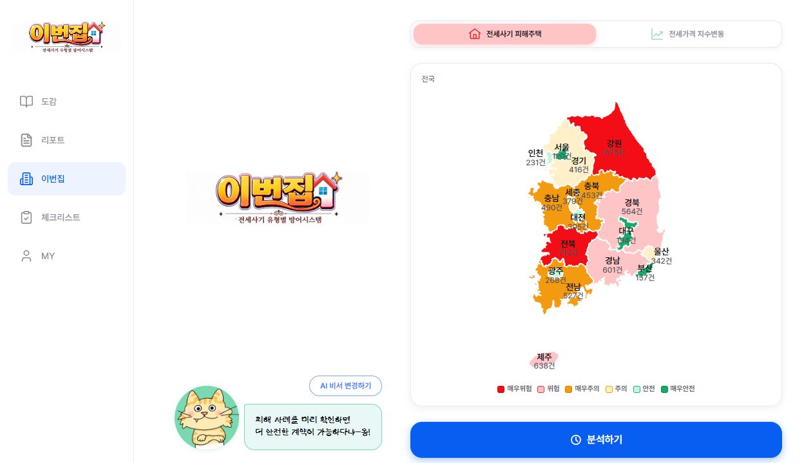
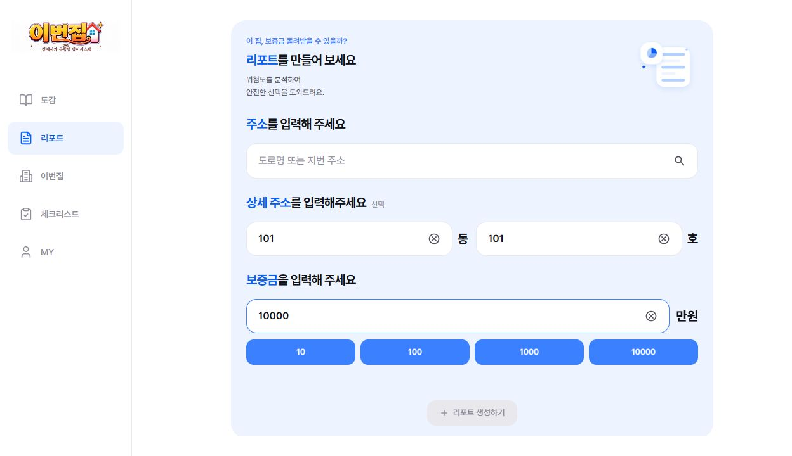
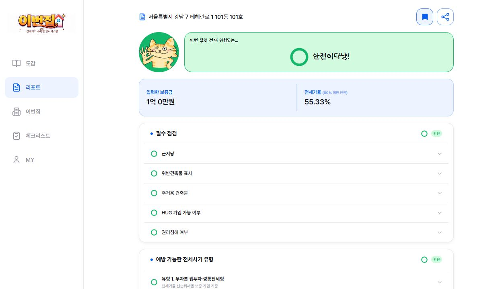
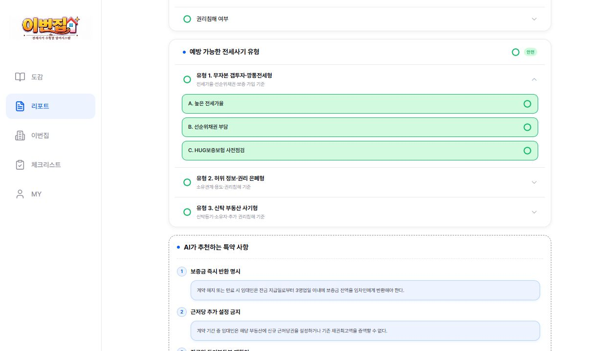
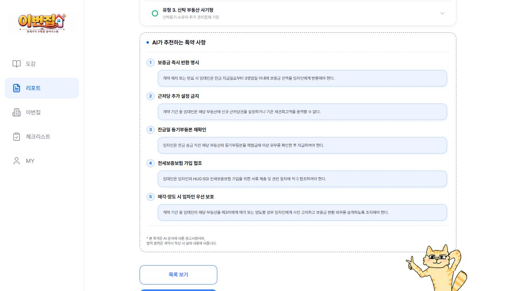
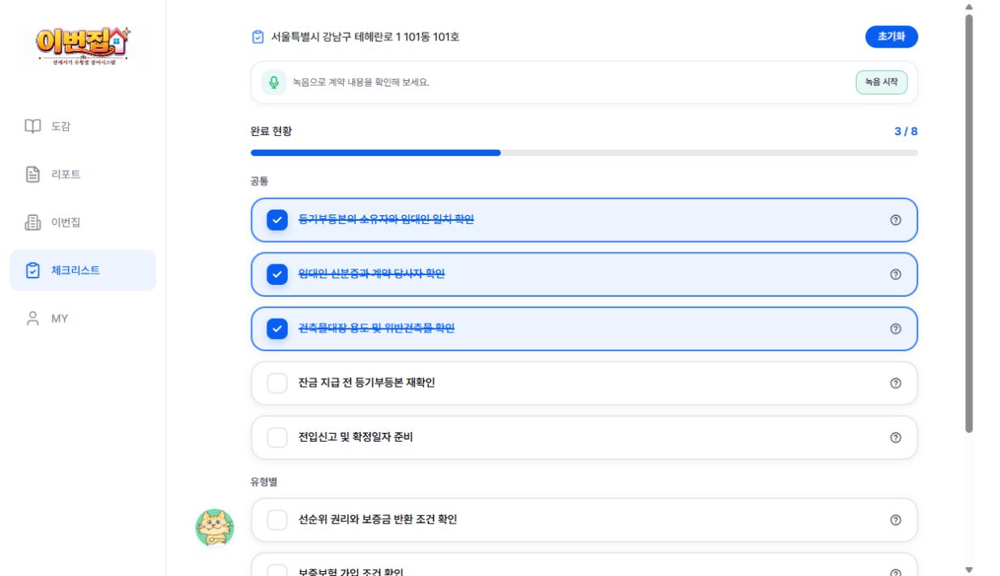
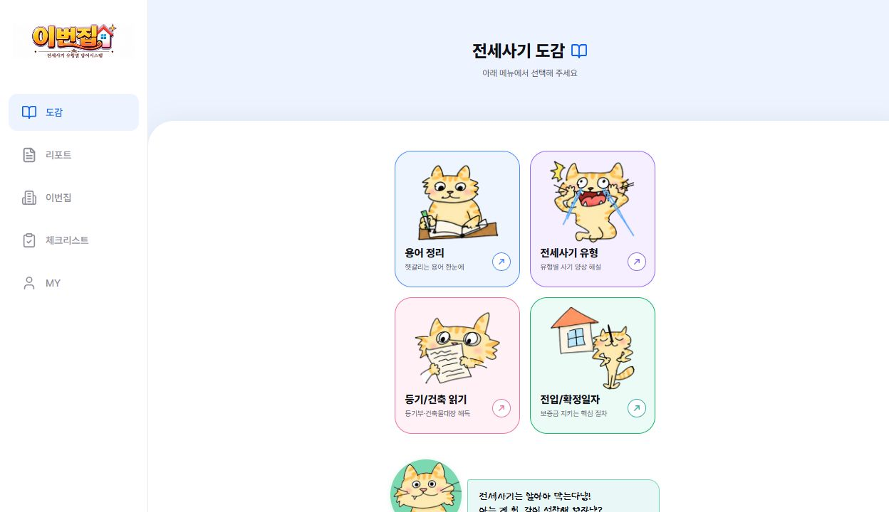
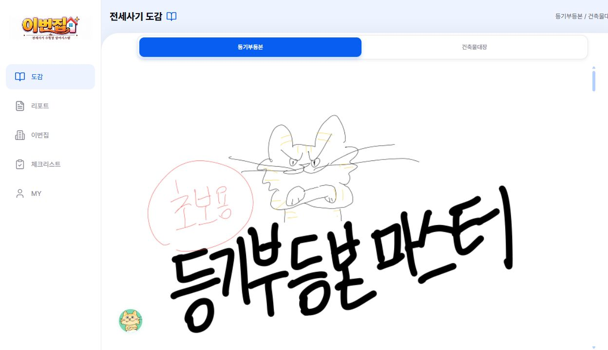
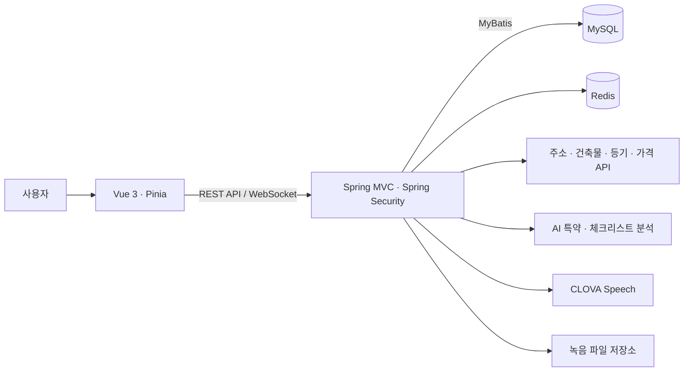

<div align="center">


# 이번집 · SECONDZIP

**집을 알아보는 순간부터 계약을 확인하는 순간까지.**

전세사기 유형별 위험 분석과 계약 체크리스트를 연결하는 서비스


[주요 기능](#주요-기능) · [서비스 화면](#서비스-화면) · [핵심 구현](#핵심-구현) · [실행 및 검증](#실행-및-검증)

</div>

---

## 프로젝트 소개

| 구분 | 내용 |
| --- | --- |
| 프로젝트 | **KB IT's Your Life 7기 최종프로젝트** |
| 개발 기간 | 2026.07.09 ~ 2026.08.26 |
| 본인 담당 업무 | **리포트(report) 관련 업무** |

전세 계약을 준비할 때는 등기부등본, 건축물대장, 가격 정보와 계약 확인 사항을 함께 살펴봐야 합니다. **이번집**은 여러 곳에 흩어진 정보를 모아 매물의 위험요소를 설명하고, 분석 이후에 확인할 내용을 체크리스트로 이어 줍니다.

주소와 보증금을 입력하면 공공·외부 데이터를 바탕으로 위험 리포트를 구성합니다. 사용자는 전세사기 유형별 점검 결과와 AI 추천 특약을 살펴보고, 계약 과정에서 녹취를 활용해 체크리스트를 확인할 수 있습니다.

> 분석 결과는 위험요소 확인을 돕는 참고자료입니다. 주택·계약의 안전성이나 실제 보증 가입을 보장하지 않습니다.

## 주요 기능

| 기능 | 사용자에게 제공하는 경험 | 구현 포인트 |
| --- | --- | --- |
| **전세 위험 분석** | 주소·보증금 입력부터 필수 점검과 전세사기 유형별 결과 확인까지 | 주소 정규화, 외부 데이터 수집, 규칙 기반 위험 판정 |
| **분석 리포트** | 위험도·판정 근거·AI 추천 특약 확인, 즐겨찾기와 링크 공유 | 리포트 영속화, 공유 토큰, AI 응답 검증 |
| **계약 체크리스트** | 분석으로 확인한 항목과 직접 확인할 항목을 함께 관리 | 리포트별 체크리스트, 분석 결과 자동 반영 |
| **녹취 기반 확인** | 실시간 녹음 또는 파일 업로드로 계약 대화의 확인 사항 정리 | WebSocket, CLOVA Speech, 비동기 AI 분석 |
| **지역 정보 지도** | 지역별 전세사기 피해 통계와 전세가격지수 탐색 | D3 Geo 지도, 지역 선택과 통계 조회 |
| **전세사기 도감** | 용어·사기 유형·공적 서류 읽기·전입 절차 학습 | 주제별 콘텐츠와 안내 캐릭터 |

## 서비스 화면

**지역 탐색 → 분석 입력 → 위험 확인 → 계약 점검**으로 이어지는 실제 서비스 UI입니다. 이미지를 클릭하면 크게 볼 수 있습니다.

> 화면의 주소·보증금·위험 판정·지도 통계·체크리스트 상태는 설명을 위한 **샘플 데이터**입니다. 실제 사용자 정보나 최신 지역 통계를 나타내지 않습니다.

### 01 · 지역 탐색과 분석 시작

| 지역 정보 지도 | 분석 리포트 만들기 |
| :---: | :---: |
| [](.github/readme/main-map.jpg) | [](.github/readme/report-create.jpg) |
| 지역별 정보를 지도에서 살펴보고 분석으로 이동합니다. | 분석할 매물의 주소와 보증금을 입력합니다. |

### 02 · 위험도와 유형별 상세 결과

| 위험 분석 요약 | 전세사기 유형별 점검 |
| :---: | :---: |
| [](.github/readme/report-preview.jpg) | [](.github/readme/report-details.jpg) |
| 보증금·전세가율과 필수 점검 결과를 한눈에 확인합니다. | 유형을 펼쳐 전세가율·선순위채권 등 세부 항목을 확인합니다. |

### 03 · 특약 확인과 계약 체크리스트

| AI 추천 특약 | 체크리스트·녹음 진입 |
| :---: | :---: |
| [](.github/readme/ai-special-terms.jpg) | [](.github/readme/checklist.jpg) |
| 분석 리포트에서 추천 특약을 살펴봅니다. | 확인한 항목과 진행률을 관리하고 녹음 기능으로 연결합니다. |

### 04 · 전세사기 예방 학습

| 전세사기 도감 | 등기부등본 읽기 |
| :---: | :---: |
| [](.github/readme/dictionary.jpg) | [](.github/readme/document-guide.jpg) |
| 용어·사기 유형·서류·전입 절차를 주제별로 탐색합니다. | 웹툰형 안내로 공적 서류를 읽는 방법을 익힙니다. |

<sub>실제 Vue 컴포넌트를 로컬에서 렌더링해 캡처했습니다. 촬영 데이터와 화면 경로는 [이미지 안내](.github/readme/README.md)에 정리했습니다.</sub>

## 핵심 구현

### 1. 여러 요청에 걸친 인증·분석 상태 관리

외부 문서 발급은 간편인증, 동·호 선택 등 추가 입력이 필요해 한 번의 요청으로 끝나지 않습니다. Redis에 요청별 상태와 사용자 소유권을 보관하고, 준비·인증·실행 단계를 분리해 다음 요청에서도 분석을 이어 갑니다.

- **동시 요청 제어:** Redis의 `SET NX`와 TTL로 요청 단위 락을 획득하고, 소유 토큰을 비교해 해제합니다.
- **결과 재사용:** `request_id`의 UNIQUE 제약과 기존 결과 조회로 동일 요청의 중복 저장·외부 재호출을 줄입니다.
- **실패 경계 분리:** 핵심 리포트 저장 이후의 부가 작업 실패가 분석 결과 전체를 덮어쓰지 않도록 처리합니다.

구현: [분석 실행 서비스](backend/src/main/java/com/secondzip/backend/report/service/workflow/AnalysisExecutionService.java) · [Redis 상태 저장소](backend/src/main/java/com/secondzip/backend/report/service/workflow/RedisAnalysisWorkflowStore.java)

### 2. 데이터가 부족한 경우를 구분하는 위험 판정

외부 응답을 내부 도메인으로 정규화한 뒤 위험 규칙을 적용합니다. 위험도와 데이터 상태를 분리해, 데이터를 확보하지 못한 항목을 안전으로 처리하지 않도록 설계했습니다.

| 데이터 상태 | 의미 |
| --- | --- |
| `VERIFIED` | 확보한 데이터로 판정한 항목 |
| `UNVERIFIED` | 데이터 부족 또는 파싱 실패로 확인하지 못한 항목 |
| `NOT_APPLICABLE` | 해당 매물에 적용하지 않는 항목 |

구현: [위험 판정 서비스](backend/src/main/java/com/secondzip/backend/report/service/RiskEvaluationService.java)

### 3. AI 결과를 서비스 데이터로 반영하기 위한 검증

AI 추천 특약은 응답을 그대로 저장하지 않고 개수, 필수 내용, 길이, 중복 여부를 검사합니다. 생성과 검증을 분리해 잘못된 형식의 응답이 리포트에 반영되는 것을 줄입니다.

구현: [특약 검증기](backend/src/main/java/com/secondzip/backend/report/service/SpecialTermValidator.java)

### 4. 실시간 녹취와 후속 분석 연결

WebSocket으로 받은 음성을 gRPC 기반 CLOVA Speech 처리와 연결하고, 녹음 저장·전사·AI 체크리스트 분석으로 이어 갑니다. 파일 업로드 방식도 지원해 계약 확인에 활용할 수 있도록 구성했습니다.

구현: [실시간 전사 서비스](backend/src/main/java/com/secondzip/backend/record/service/LiveTranscriptionServiceImpl.java) · [녹음 처리 서비스](backend/src/main/java/com/secondzip/backend/record/service/RecordingServiceImpl.java)

> Redis 락은 TTL에 기반하므로 처리 시간이 만료 시간을 넘는 상황까지 단일 실행을 보장하지 않습니다. 외부 API의 응답 시간과 재시도 정책을 함께 고려해야 합니다.

## 시스템 구성



| 영역 | 기술 |
| --- | --- |
| Frontend | Vue 3, Vite, Vue Router, Pinia, Axios, Bootstrap, D3 Geo |
| Backend | Java 17, Spring MVC 5.3, Spring Security 5.8, JWT, Tomcat 9 |
| Database & State | MySQL 8, MyBatis, Flyway, Redis |
| Integration | CODEF, Kakao, 공공데이터 API, OpenAI API, CLOVA Speech |
| Delivery | Docker, GitHub Actions, GHCR, AWS EC2·SSM |
| Testing | Vitest, Vue Test Utils, JUnit 5, Mockito, Spring Test, JaCoCo |

DB 스키마의 변경 이력은 [Flyway 마이그레이션](backend/src/main/resources/db/migration)에서 확인할 수 있습니다.

## 저장소 구조

```text
second-zip-app/
├── frontend/                 # Vue 화면, 상태 관리, API 연동, 테스트
├── backend/                  # Spring MVC API, 도메인 로직, 테스트
│   └── src/main/resources/
│       ├── db/migration/     # Flyway 스키마 변경 이력
│       └── .env.example      # 백엔드 환경변수 예시
├── docker/                   # MySQL·Redis·앱 컨테이너 구성
└── .github/
    ├── workflows/           # 프론트엔드·백엔드 CI 및 배포
    └── readme/              # 서비스 화면 이미지
```

## 실행 및 검증

### 프론트엔드

Node.js `^20.19.0` 또는 `>=22.12.0`이 필요합니다.

```sh
cd frontend
npm ci
npm run dev
```

API를 연결할 때는 `frontend/.env`에 `VITE_API_BASE_URL`을 설정합니다. 백엔드를 로컬 Tomcat의 루트 컨텍스트로 실행한 경우의 예시는 다음과 같습니다.

```dotenv
VITE_API_BASE_URL=http://localhost:8080/api
```

리포트 예시 화면은 `/report/analysis/preview/a`, 도감은 `/dictionary`에서 확인할 수 있습니다. 실제 분석과 회원 기능에는 백엔드 및 외부 서비스 설정이 필요합니다.

### 백엔드

Java 17과 MySQL·Redis 연결이 필요합니다. [환경변수 예시](backend/src/main/resources/.env.example)를 참고해 로컬 `.env`를 준비하고 DB 계정·주소, JWT 및 사용하는 외부 서비스 설정을 채웁니다.

로컬 인프라만 실행하려면 저장소 루트에서 다음 명령을 사용합니다.

```sh
docker compose -f docker/docker-compose.yml up -d mysql redis
```

Compose의 MySQL 노출 포트는 `3306`이고 `.env.example`의 DB URL은 `3307`이므로, 실행 환경에 맞게 포트와 계정을 일치시켜야 합니다.

```sh
cd backend
./gradlew test war
```

Windows PowerShell에서는 `./gradlew.bat test war`를 사용합니다. 결과물은 `backend/build/libs/secondzip.war`이며 Tomcat 9에 배포합니다. Docker 실행 방식은 [Compose 구성](docker/docker-compose.yml)과 [백엔드 Dockerfile](backend/Dockerfile)을 참고하세요.

### 테스트

| 대상 | 명령 · 실행 위치 |
| --- | --- |
| 프론트엔드 테스트 | `frontend/`에서 `npm test` |
| 프론트엔드 커버리지 | `frontend/`에서 `npm run test:coverage` |
| 백엔드 테스트·JaCoCo 리포트 | `backend/`에서 `./gradlew test` |

판정 경계값, 외부 API 파싱·실패 처리, 분석 워크플로와 사용자 화면 동작 등을 테스트합니다. 커버리지 설정은 [Vite 설정](frontend/vite.config.js)과 [Gradle 설정](backend/build.gradle)에서 확인할 수 있습니다.

## 코드와 설정 더 보기

| 경로 | 내용 |
| --- | --- |
| [분석 워크플로](backend/src/main/java/com/secondzip/backend/report/service/workflow) | 준비·인증·실행 단계와 Redis 상태 관리 |
| [백엔드 테스트](backend/src/test/java/com/secondzip/backend) | 도메인 판정과 외부 연동 검증 |
| [프론트엔드 화면](frontend/src/views) | 리포트, 도감, 체크리스트와 회원 화면 |
| [CI·배포 워크플로](.github/workflows) | 테스트 자동화와 컨테이너 배포 |
